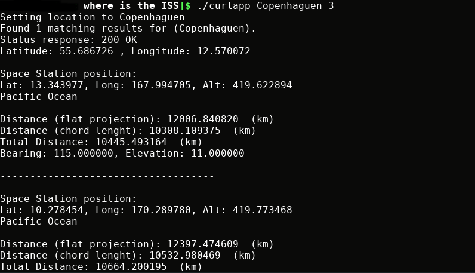

# Where the ISS at?

## About
(This is an unfinished project, still under contruction :construction:)

Where is the ISS at? C project with Arduino/Raspberry Pi that gets the instant position (latitude, longitude, altitude) of the International Space Station, and points towards its location in the sky depending on the user location (latitude, longitude, altitude=0).

## Requirements
Project requires `ljson-c` and `curl`. 

## Usage
Makefile takes care of dependencies and generates executable `curlapp`.
- Clean previous outfiles `make clean`
- Build executable `make`
- Run executable `./curlapp UserCity numCycles` (if argument is ommited uses default, Copenhaguen and 1 cycle)   

The executable returns User coordinates, Iss current position in coordinates and formatted text, returns distance in flat projection, chord length, and true distance with bearing and elevation angle. As below:

## Structure
* curlapp.c: gets user coords, gets Iss coords, computes distance between, bearing and elevation angles. Main program.
* servo.c: Script for controlling the servo motors (to be loaded in arduino, yet untested).

